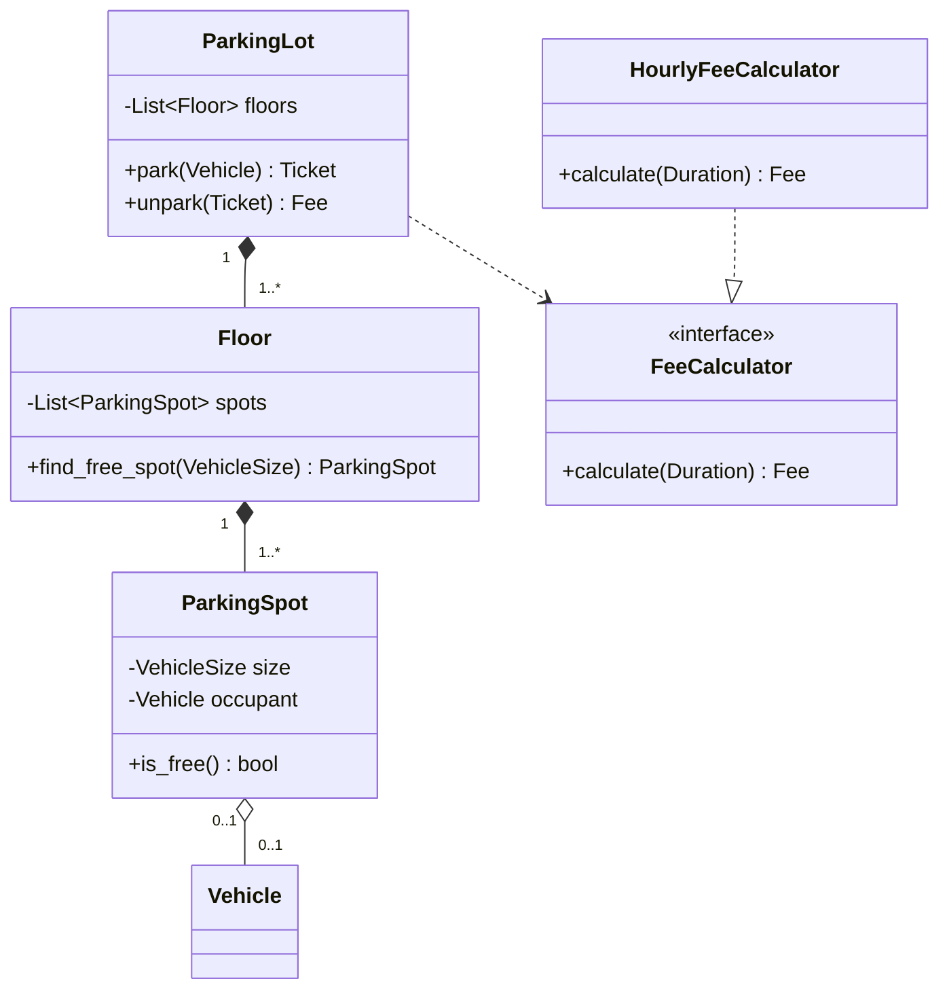
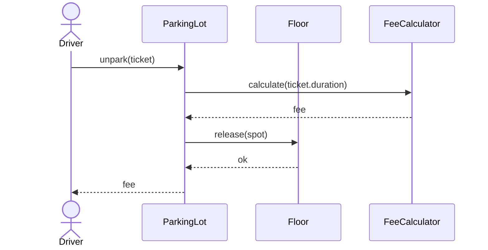
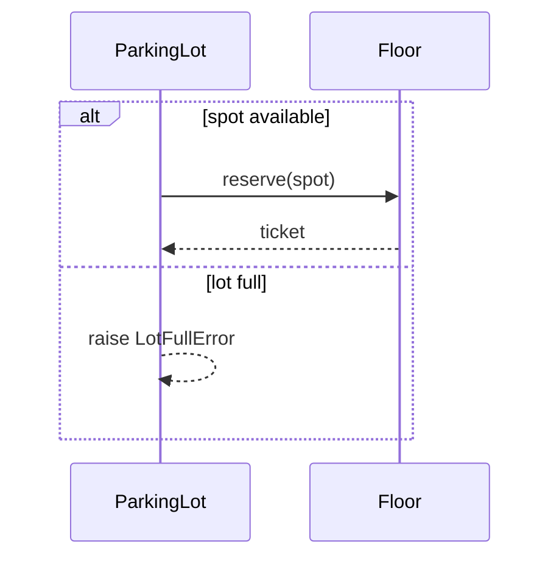
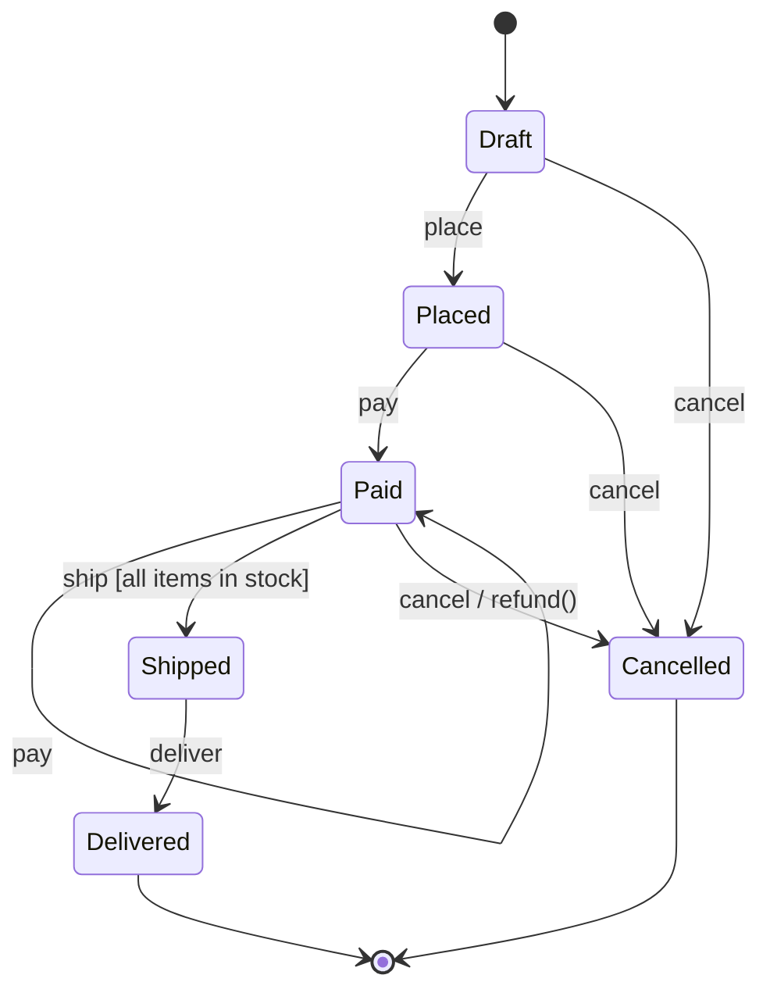
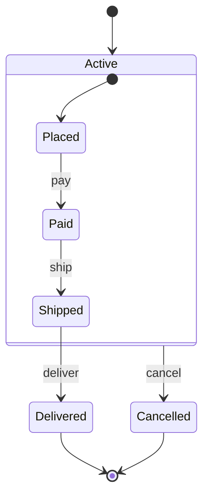

# Chapter 0 — Foundations

> Everything the later chapters *assume* you already know.
>
> This chapter exists because the SOLID and second-tier notes required artifacts they
> never taught: class diagrams are a deliverable in P09/P10, sequence diagrams are
> named a required interview artifact, P09 asks for a state-driven design without ever
> showing a state diagram, and terms like *seam*, *composition root*, and *train wreck*
> are used long before anything defines them.
>
> Read this first. Link back to it whenever a term appears.

---

## 1. Glossary

One definition per term. Every other file links here instead of redefining.

| Term | Definition |
| --- | --- |
| **Actor** | The person or team who would ask you to change a piece of code. The unit SRP counts. Not a user of the software — a *reason for change*. |
| **Contract** | The full set of promises a method makes: what it requires (preconditions), what it guarantees (postconditions), and what stays true throughout (invariants). |
| **Precondition** | What the *caller* must satisfy before calling. "`amount` must be positive." A subclass may only **weaken** these. |
| **Postcondition** | What the *method* guarantees on return. "Balance is reduced by exactly `amount`." A subclass may only **strengthen** these. |
| **Frame condition** | The part of a postcondition covering what a method will **not** touch. "`set_width` leaves height alone." Frequently mislabelled an invariant. |
| **Invariant** | A predicate on **state** that holds before and after every public method. "`balance >= 0`." Test: can you check it by inspecting the object at rest, with no knowledge of which method just ran? If no, it is a postcondition. |
| **Seam** | A place where you can change behaviour without editing the code around it. A constructor parameter typed as an interface is a seam; a hardcoded `StripeGateway()` is not. |
| **Composition root** | The single place in an application that knows which concrete classes exist and wires them together. Usually `main()`, or the `if __name__ == "__main__":` block. Everywhere else depends on abstractions. |
| **God object** | A class that accumulated responsibilities until nearly every change touches it. The end state of ignoring SRP. |
| **Train wreck** | `a.getB().getC().getD()` — a chain that traverses several objects' internal structure. The visible symptom of a Law of Demeter violation. |
| **World / domain** | A cluster of responsibility owned by one actor: persistence, business logic, communication, observability, presentation, security. Used when counting responsibilities. |
| **Coupling** | How much one piece of code must know about another. Lower is better. |
| **Cohesion** | How strongly the parts of one class belong together. Higher is better. A class with high cohesion is hard to split sensibly. |
| **Test double** | Any stand-in for a real dependency. A **fake** has a working lightweight implementation; a **stub** returns canned answers; a **mock** additionally asserts how it was called. |
| **Structural typing** | Compatibility determined by *shape* (does it have the methods?) rather than declared inheritance. What Python's `Protocol` provides. |
| **Nominal typing** | Compatibility determined by declared inheritance. What `ABC` provides. |

---

## 2. Requirements → Classes

The hardest step, and the one most notes skip entirely. You are handed a paragraph of
English and must produce classes. Here is a repeatable procedure.

### The problem statement

> *"A parking lot has multiple floors. Each floor has parking spots of different sizes.
> A vehicle arriving is issued a ticket and assigned a spot matching its size. On exit,
> the ticket is used to calculate a fee based on the duration parked."*

### Step 1 — Underline the nouns. These are candidate classes.

```
parking lot, floor, parking spot, size, vehicle, ticket, spot assignment, fee, duration
```

### Step 2 — Delete nouns that are not classes

Three categories get cut:

- **Attributes, not classes.** `size` and `duration` are properties of something else.
  A class needs *behaviour* or *identity*. `size` has neither — it is an enum.
- **Synonyms.** `parking lot` and `floor` are distinct; `spot assignment` is just what
  the act of assigning produces — it is already covered by `ticket`.
- **Actors outside the system.** The attendant, the driver — unless you must model them.

Surviving: `ParkingLot`, `Floor`, `ParkingSpot`, `Vehicle`, `Ticket`, and `Fee` as a
value produced by a calculator.

### Step 3 — Underline the verbs. These are candidate methods.

```
arrives, is issued, assigned, used to calculate, exits
```

### Step 4 — Assign each verb to the noun that owns the data it needs

This is the step that decides your design.

| Verb | Needs | Owner |
| --- | --- | --- |
| assign a spot | knowledge of all spots and their availability | `Floor` (or `ParkingLot` delegating to floors) |
| issue a ticket | vehicle + spot + entry time | `ParkingLot` |
| calculate fee | entry time + exit time + rate rules | `FeeCalculator` — *not* `Ticket` |

> **Why `FeeCalculator` and not `Ticket.calculate_fee()`?** Pricing rules change for
> business reasons (weekend rates, EV discounts); ticket structure changes for
> different reasons. Different actors → different classes. That is SRP applied at the
> moment of design rather than as a later refactor.

### Step 5 — Sanity-check against the principles

- Can any class be described in one sentence with no "and"? If not, split it.
- Does anything reach two levels deep (`lot.floor.spots[0].vehicle`)? Add a delegating
  method.
- Is there an `if type == ...` ladder? That is a missing polymorphic hierarchy.

---

## 3. UML Class Diagrams

You only need five relationships. Getting these right is most of what a class diagram
communicates.

### The relationships, weakest to strongest

```
Association    A ────────> B     "A knows about B"
Aggregation    A ◇────────> B     "A has B, but B survives without A"
Composition    A ◆────────> B     "A owns B; B dies with A"
Inheritance    A ────────▷ B     "A is-a B"
Realization    A ┈┈┈┈┈┈┈▷ B     "A implements interface B"
```

Read the diamond as *ownership of lifetime*, which is the distinction people most often
get wrong:

| | Symbol | Lifetime | Example |
| --- | --- | --- | --- |
| **Aggregation** | hollow ◇ | Independent | A `Team` has `Player`s. Delete the team; the players still exist. |
| **Composition** | filled ◆ | Dependent | An `Order` has `OrderLine`s. Delete the order; the lines are meaningless and go with it. |

```python
# AGGREGATION: players are passed in; they existed before Team and outlive it
class Team:
    def __init__(self, players: list["Player"]):
        self._players = list(players)     # copy the list, not the players


# COMPOSITION: Order creates its own lines; they have no life outside it
class Order:
    def __init__(self):
        self._lines: list["OrderLine"] = []

    def add_line(self, sku: str, qty: int) -> None:
        self._lines.append(OrderLine(sku, qty))   # created here, owned here
```

The rule of thumb: **if the part is passed into the constructor, it is usually
aggregation. If the whole constructs the part itself, it is usually composition.**

### Multiplicity

Written at each end of the line. `1`, `0..1`, `*` (zero or more), `1..*` (one or more),
`2..5` (a range).

```
ParkingLot ◆──1────1..*──> Floor
Floor      ◆──1────1..*──> ParkingSpot
ParkingSpot ──0..1────0..1──> Vehicle
```

Read the last line as: a spot holds zero or one vehicle, and a vehicle occupies zero or
one spot. Multiplicity is where you encode business rules that are otherwise invisible —
`1..*` on Floor says *a parking lot with no floors is not a valid parking lot.*

### A worked diagram (Mermaid — renders on GitHub)



Notation cheat sheet: `*--` composition, `o--` aggregation, `-->` association,
`..|>` realization, `--|>` inheritance. `-` private, `+` public.

---

## 4. Sequence Diagrams

Named as a required interview artifact and never previously shown. A sequence diagram
answers *"in what order do these objects talk, and who waits for whom?"*

Use it for the **one** flow with the most interaction — usually the one with an external
call, a failure path, or concurrency.



Arrow semantics:

| Arrow | Meaning |
| --- | --- |
| `->>` | Synchronous call — the caller blocks |
| `-->>` | Return value |
| `-)` | Asynchronous message — caller does not wait |
| `x` at the end | Message lost / failure path |

Two things worth drawing that candidates usually omit:



`alt/else` shows branching; `loop` shows repetition. Drawing the *failure* branch is
what signals you have thought past the happy path.

---

## 5. State Diagrams

Listed as an artifact in the table below and required in spirit by P09, but never shown
until now. A state diagram answers *"what states can **one** object be in, and which
events move it between them?"*

The class diagram shows structure. The sequence diagram shows one flow through time.
The state diagram shows **every** flow one object can take — including the ones nobody
mentioned in the requirements. That is what it is for: the arrows you *cannot* draw are
the illegal transitions, and those are the bugs.

### The example: order lifecycle

Deliberately not the vending machine — that is P09, and the notes must not hand you the
answer to an exercise.



Read it as six states and four events. Note what is **absent**: there is no arrow out of
`Delivered` at all, and none out of `Shipped` labelled `cancel`. Those omissions are the
design. A diagram whose every state connects to every other state has decided nothing.

The loop `Paid --> Paid: pay` is not noise either — it is the explicit decision that a
duplicate payment event is *absorbed* rather than rejected. Without it drawn, that
question stays unasked until a retry hits production.

### Notation

| Notation | Meaning |
| --- | --- |
| `[*] --> A` | Initial state — where the object begins life |
| `A --> [*]` | Final state — the object is done; no further events accepted |
| `A --> B: event` | `event` moves the object from `A` to `B` |
| `A --> B: event [guard]` | Transition only fires when the guard is true |
| `A --> B: event / action` | `action` runs as part of the transition |
| `A --> A: event` | Self-transition — the event is accepted and changes nothing |
| `state A { ... }` | Composite state — a group with its own inner states |

Two additions worth knowing:

- **entry / exit actions** belong to the *state*, not the arrow. `Paid: entry / send_receipt()`
  fires however you arrived at `Paid`. Use these when an action must happen on every
  inbound arrow — otherwise you will forget one when a seventh transition is added.
- **Composite states** collapse repetition. Instead of drawing `cancel` from each of
  three states:



One arrow now says *"cancel works from anywhere inside `Active`."*

### The completeness check

This is the part that earns the diagram its keep. Put states down the side, events
across the top, and fill in every cell. Blanks are decisions you have not made yet.

| | `place` | `pay` | `ship` | `deliver` | `cancel` |
| --- | --- | --- | --- | --- | --- |
| **Draft** | → Placed | ✗ | ✗ | ✗ | → Cancelled |
| **Placed** | ✗ | → Paid | ✗ | ✗ | → Cancelled |
| **Paid** | ✗ | → Paid (ignore, idempotent) | → Shipped | ✗ | → Cancelled + refund |
| **Shipped** | ✗ | ✗ | ✗ | → Delivered | **?** |
| **Delivered** | ✗ | ✗ | ✗ | ✗ | ✗ |
| **Cancelled** | ✗ | ✗ | ✗ | ✗ | ✗ |

The `?` is the whole exercise. *Can you cancel a shipped order?* Nobody said. The grid
made the gap visible; in an interview you now ask the question instead of picking
silently. Notice too that three different answers hide behind "nothing happens":
**reject** (`✗`, raise), **ignore** (accept, no state change), and **queue for later**.
The grid forces you to pick one per cell.

### From diagram to code

The diagram transcribes directly into a transition table. One dict entry per arrow.

```python
from enum import Enum, auto


class OrderState(Enum):
    DRAFT = auto()
    PLACED = auto()
    PAID = auto()
    SHIPPED = auto()
    DELIVERED = auto()
    CANCELLED = auto()


class IllegalTransition(Exception):
    """Raised when an event arrives that the current state does not accept."""


# The diagram, transcribed. One entry per arrow — nothing else is legal.
TRANSITIONS: dict[tuple[OrderState, str], OrderState] = {
    (OrderState.DRAFT, "place"): OrderState.PLACED,
    (OrderState.DRAFT, "cancel"): OrderState.CANCELLED,
    (OrderState.PLACED, "pay"): OrderState.PAID,
    (OrderState.PLACED, "cancel"): OrderState.CANCELLED,
    (OrderState.PAID, "pay"): OrderState.PAID,          # self-loop: duplicate pay absorbed
    (OrderState.PAID, "ship"): OrderState.SHIPPED,
    (OrderState.PAID, "cancel"): OrderState.CANCELLED,
    (OrderState.SHIPPED, "deliver"): OrderState.DELIVERED,
}


class Order:
    def __init__(self) -> None:
        self._state = OrderState.DRAFT

    @property
    def state(self) -> OrderState:
        return self._state

    def handle(self, event: str) -> None:
        try:
            self._state = TRANSITIONS[(self._state, event)]
        except KeyError:
            raise IllegalTransition(
                f"cannot {event!r} an order in state {self._state.name}"
            ) from None


if __name__ == "__main__":
    order = Order()
    for event in ("place", "pay", "ship", "deliver"):
        order.handle(event)
        print(order.state.name)

    try:
        order.handle("cancel")      # DELIVERED has no cancel arrow — by design
    except IllegalTransition as exc:
        print(f"rejected: {exc}")
```

**The limit of the table** — and the reason the State pattern exists. A table encodes
*which transitions are legal*. It cannot encode *behaviour that differs per state*: the
guard `[all items in stock]`, the `/ refund()` action, or a `pay` that means something
different in each state. The moment cells need their own logic, you are writing
`if state == ...` inside `handle()`, and that is the ladder from §2 step 5 all over
again. Promote each state to a class then — one object per state, each owning its own
behaviour. That is exactly what P09 asks for.

Rough guide, not a law: a **table** while transitions are legality-only, a **State
pattern** once two or more states need different logic for the same event. Counter-case:
a machine with fifteen states but only one behavioural difference is still clearer as a
table plus one conditional than as fifteen classes.

### When not to draw one

- **The object has two states.** `active` / `inactive` with no illegal transitions is a
  boolean. A diagram adds ceremony, not information.
- **State is derived, not stored.** If "overdue" is just `due_date < today`, it is a
  computed property. Only model states the object *transitions* between and *remembers*.
- **The interesting behaviour is interaction, not lifecycle.** A payment flow that
  touches four services in order wants a sequence diagram; the object itself may only
  ever be `pending` then `settled`.

The trigger to reach for one: you catch yourself saying *"…but only if it hasn't already
been X'd."* That sentence is a missing state machine.

---

## 6. What to draw, and when

| Question being asked | Artifact |
| --- | --- |
| What are the pieces and how do they relate? | Class diagram |
| In what order do they interact? | Sequence diagram |
| What states can one object be in? | State diagram |

In a 45-minute round: class diagram always, sequence diagram for exactly one flow, state
diagram only if the problem is state-driven (vending machine, order lifecycle, elevator).

Draw the class diagram **after** step 4 of the requirements process above, not before.
The diagram is a record of decisions already made — it is not where you make them.
